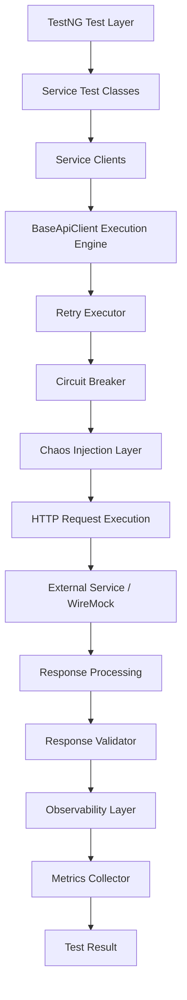
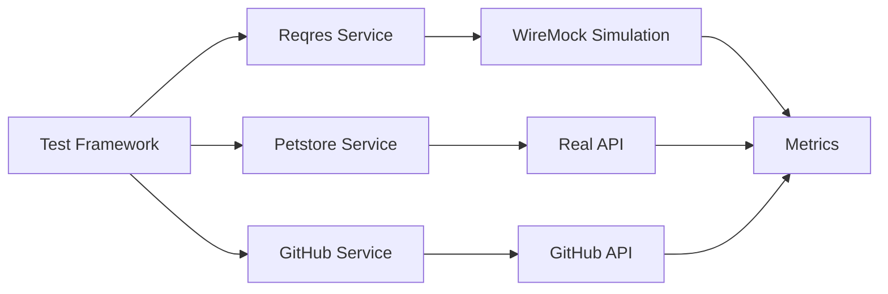
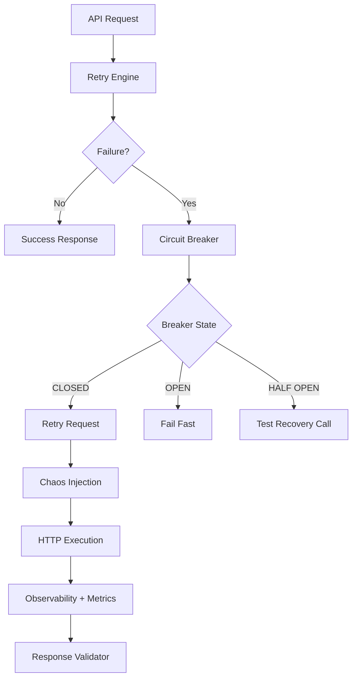
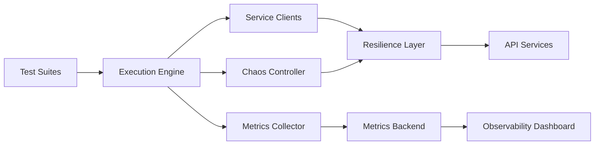
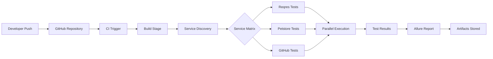

# restassured-enterprise-framework – Enterprise API Automation Platform


Enterprise-grade **API automation and resilience testing framework** built with:

* Java
* Rest Assured
* TestNG
* Maven
* WireMock
* Allure Reporting
* CI/CD (GitHub Actions & Jenkins)

The framework is engineered not only to validate API correctness but also to simulate **real distributed system behavior**, including:

* retry handling
* circuit breaker protection
* chaos testing
* service isolation
* observability
* SLA validation

This project demonstrates **production-level API client architecture** rather than a traditional test suite.

---

# Project Goals

Most automation frameworks only verify:

* status codes
* response body validation
* schema checks

This framework goes further by testing **system reliability characteristics**.

Key engineering goals:

• Service isolation
• Idempotent retry strategy
• Circuit breaker resilience
• Chaos engineering simulation
• Observability and metrics
• SLA validation
• Deterministic parallel execution
• CI/CD pipeline orchestration

The objective is to simulate **how real microservices interact with external APIs**.

---

# System Architecture

This diagram shows the **complete execution flow of the framework**.



Execution pipeline:

```
Tests
 → Service Clients
 → Resilience Layer
 → Chaos Injection
 → HTTP Execution
 → Observability
 → Validation
```

This architecture mirrors **enterprise API client design**.

---

# Service Isolation Architecture

The framework supports **multiple APIs within a single automation platform**.



### Supported Services

| Service  | Type     | Description                               |
| -------- | -------- | ----------------------------------------- |
| ReqRes   | Mocked   | Deterministic API simulation via WireMock |
| Petstore | Real API | Public Swagger API                        |
| GitHub   | Real API | Requires authentication token             |

Each service operates with **independent configuration and resilience policies**.

---

# Resilience Layer Architecture

The framework integrates **distributed system resilience patterns**.



Implemented resilience mechanisms:

• Retry with exponential backoff
• Circuit breaker protection
• Chaos injection simulation
• Observability and metrics
• SLA validation

These patterns are widely used in **distributed systems and microservices architectures**.

---

# Distributed Testing Platform Architecture

This diagram illustrates how the framework can scale into a **testing platform**.



This architecture supports future expansion into:

• observability dashboards
• distributed tracing
• metrics backend
• chaos testing platform

---

# Project Structure
For Reference: https://github.com/MK-MAN0JKUMAR/restassured-enterprise-framework/blob/main/Project%20Structure
```
restassured-enterprise-framework/
├── .github/workflows
│              └── api-tests.yml
├── src/
│   ├── main/java/framework/
│   │       		├── client/
│   │       		├── constants/
│   │       		├── core/
│   │       		│	     ├── annotation/
│   │       		│	     ├── chaos/
│   │       		│	     ├── config/
│   │       		│	     ├── exception/
│   │       		│	     ├── http/
│   │       		│	     ├── metrics/
│   │       		│	     ├── mock/
│   │       		│	     ├── observability/
│   │       		│	     ├── pagination/
│   │       		│	     ├── reporting/
│   │       		│	     ├── resilience/
│   │       		│	     ├── retry/
│   │       		│	     ├── schema/
│   │       		│	     └── validation/
│   │       		│
│   │       		├── data/
│   │       		│	     ├── github/
│   │         │      │        └── builders/
│   │       		│	     ├── petstore/
│   │         │      │        └── builders/
│   │       		│	     ├── reqres/
│   │         │      │        └── builders/
│   │       		│	     ├── DataContext.java
│   │       		│      └── DataSeedManager.java
│   │       		│
│   │       		├── domain/
│   │       		│	     ├── common/
│   │       		│	     ├── github/
│   │       		│	     ├── petstore/
│   │       		│	     └── reqres/
│   │       		└── utils (empty)
│   │
│   └── test/
│       ├── java/
│       │	      ├── framework/
│       │       │	     ├── core/
│       │       │	     │      ├── listener/
│       │       │	     │      └── service/
│       │       │	     └── tools/
│       │	      └── tests/
│       │    		          ├── base/
│       │    		          ├── github/
│       │    		          ├── petstore
│       │    		          └── reqres/
│       │    			                 └── stubs/
│   	   └── resources/
│      		          ├── config/
│       	          └── schemas/
│           		               ├── petstore/
│              	             ├── reqres/
│              	             └── sample-image.jpg
├── Jenkinsfile
├── .gitignore
├── Project Structure
├── testng.xml
├── README.md
└── pom.xml
```

---

# Core Engineering Components

## Retry Engine

Capabilities:

• retries only idempotent requests
• exponential backoff strategy
• configurable retry policies

Purpose:

Handle **transient network failures** without creating flaky tests.

---

## Circuit Breaker

Each service maintains an independent circuit breaker.

States:

```
CLOSED
OPEN
HALF-OPEN
```

Benefits:

• prevents cascading failures
• protects unstable services
• simulates production safety patterns

---

## Chaos Injection

Chaos mode simulates unstable environments.

Example runtime flags:

```
-Dchaos.enabled=true
-Dchaos.failure.rate=0.3
-Dchaos.latency.ms=500
```

Capabilities:

• artificial latency
• random failures
• resilience testing

---

## Observability Layer

Each request is assigned a **correlation ID**.

Captured telemetry:

• service name
• response time
• request metadata
• response metadata

Example metrics output:

```
Service: GITHUB  | Calls: 20 | Avg: 1502 ms | Max: 3605 ms
Service: PETSTORE| Calls: 10 | Avg: 1780 ms | Max: 2467 ms
Service: REQRES  | Calls: 3  | Avg: 287 ms  | Max: 385 ms
```

Automation becomes a **diagnostic tool**, not just a validation suite.

---

# CI/CD Pipeline



Pipeline flow:

```
Code Push
 → Build
 → Service Discovery
 → Parallel Execution
 → Report Generation
 → Artifact Storage
```

---

# Running the Framework

### Basic Execution

```
mvn clean test -Denv=qa
```

---

### Run Smoke Tests

```
mvn clean test -Dgroups=smoke
```

---

### Run Specific Service

```
mvn clean test -Dservice=reqres
```

Multiple services:

```
mvn clean test "-Dservice=reqres,petstore"
```

---

### Chaos Mode Execution

```
mvn clean test -Denv=qa -Dchaos.enabled=true -Dchaos.failure.rate=0.3
```

---

# Allure Reporting

Generate report locally:

```
mvn allure:serve
```

CI stores reports in:

```
target/site/allure-maven-plugin
```

---

# Adding a New Service

Steps:

1. Add new **ServiceType enum**
2. Add configuration properties
3. Create a client extending **BaseApiClient**

Example:

```
PaymentsClient extends BaseApiClient
```

4. Configure resilience policies if required
5. Add tests inside

```
tests/payments
```

No core framework modification required.

---

# Engineering Principles

The framework follows:

• service isolation
• configuration-driven execution
• fail-fast configuration validation
• deterministic parallel execution
• observability-first automation
• resilience-aware testing

---

# Future Enhancements

Potential platform extensions:

• Prometheus metrics export
• Grafana dashboards
• distributed tracing
• memory leak detection
• YAML-based resilience configuration
• test impact analysis

---

# Author

Manoj Kumar
SDET | Automation Engineer

Technology Stack
Java | Rest Assured | TestNG | WireMock | Maven | Allure | CI/CD (GitHub Actions, Jenkins)

---
